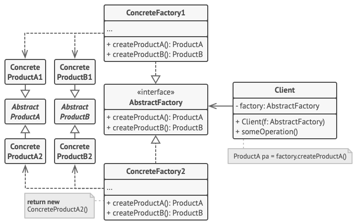

# Abstract Factory Design Pattern

## Definition

Abstract Factory is a creational design pattern that lets you produce families of related objects without specifying their concrete classes.

## Example
### GUI elements factory based on used OS

Client is given with GUI factory based on it's operating system. Application class in constructor
has relevant parameter of GUIFactory type. Thanks to this we can decide how application is being
built and makes it kind of platform independent. It's a mock but gives a good idea of the concept.

## Other

- Example is from awesome website [Refactoring Guru](https://refactoring.guru)

